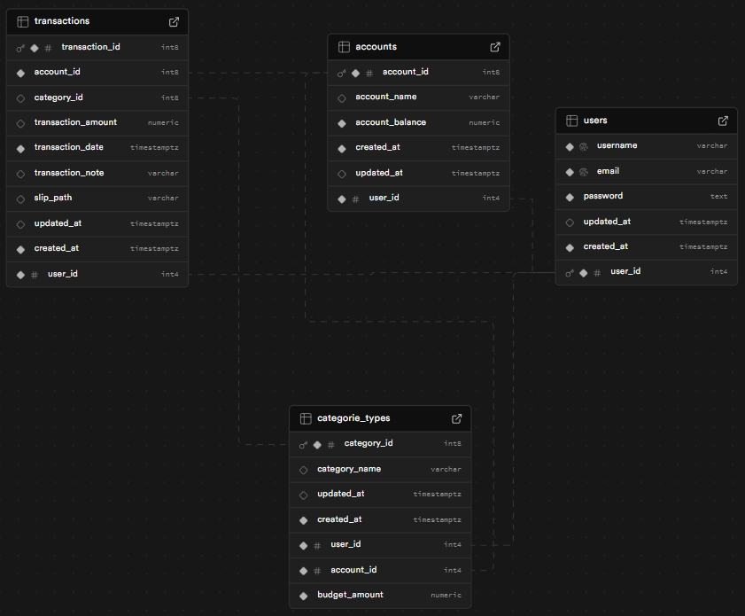

# Expense Management System

This project is an **Expense Management System** built with Node.js, Express.js, and PostgreSQL. The application allows users to manage their accounts, categories, and transactions with features like authentication, filtering, and summary generation.

---

## Features

### Core Functionalities

- **User Authentication**
  - User registration and login with JWT-based authentication.
- **Account Management**
  - Add, update, delete, and list user accounts.
- **Category Management**
  - Add, update, delete, and list expense categories linked to accounts.
- **Transaction Management**
  - Add transactions with optional categories and accounts.
  - Generate summaries and filter transactions by month, year, account, or category.

### Additional Features

- **Pagination**
  - Retrieve paginated results for transaction listings.
- **Secure Environment**
  - Secrets like JWT keys and database credentials are managed via `.env`.

---

## Tech Stack

### Backend

- **Node.js**
- **Express.js**
- **PostgreSQL**
- **pg** (PostgreSQL client for Node.js)

### Authentication

- **JWT (JSON Web Token)**

---

### Set Up Environment Variables

Create a `.env` file in the root directory with the following variables:

- DB_POSTGRES_DATABASE_URL="postgresql://"username":"password"@"host":"port"/"database""
- JWT_SECRET="your-secret-key"

get secret key with: node --> node -e "console.log(require('crypto').randomBytes(64).toString('hex'))"

---

## Database Schema (ERD)

Below is the Entity-Relationship Diagram (ERD) of the database schema:



---

## Testing API with Postman

Below are the examples of testing APIs using Postman. Make sure to set the `Authorization` header with the Bearer Token before making requests.

---

### Authentication Endpoints

#### **1. Register**
- **Method:** POST
- **Endpoint:** `/auth/register`
- **Body:**
  ```json
  {
    "username": "example",
    "email": "example@example.com",
    "password": "password123"
  }

#### **2. Login**
- **Method:** POST
- **Endpoint:** `/auth/login`
- **Body:**
  ```json
  {
     "email": "example@example.com",
     "password": "password123"
  }

#### **3. Get user**
- **Method:** POST
- **Endpoint:** `/auth/user/:userId`

---

### Account Endpoints

#### **1. Add Account**
- **Method:** POST
- **Endpoint:** `/account`
- **Body:**
  ```json
  {
    "accountName": "Savings"
  }

#### **2. List Accounts**
- **Method:** GET
- **Endpoint:** `/account`


#### **3. Update Account**
- **Method:** PUT
- **Endpoint:** `/account/:accountId`
- **Body:**
  ```json
  {
    "accountBalance": 1500
  }

#### **4. DELETE Account**
- **Method:** DELETE
- **Endpoint:** `/account/:accountId`

---

### Category Endpoints

#### **1. Add Category**
- **Method:** POST
- **Endpoint:** `/category`
- **Body:**
  ```json
  {
    "categoryName": "Groceries",
    "accountId": 1
  }

#### **2. List Category**
- **Method:** GET
- **Endpoint:** `/category`


#### **3. Update Category**
- **Method:** PUT
- **Endpoint:** `/category/categoryId`
- **Body:**
  ```json
  {
    "budgetAmountChange": 100
  }

#### **4. DELETE Category**
- **Method:** DELETE
- **Endpoint:** `/category/categoryId`

---

### Transaction Endpoints

#### **1. Add Transaction**
- **Method:** POST
- **Endpoint:** `/transaction`
- **Body (With accountId):**
  ```json
  {
    "accountId": 1,
    "categoryId": 2,
    "transactionAmount": 200,
    "transactionNote": "Bought fruits",
    "transactionDate": "2025-01-15"
  }

- **Body (With out accountId):**
  ```json
  {
    "categoryId": 2,
    "transactionAmount": 200,
    "transactionNote": "Bought fruits",
    "transactionDate": "2025-01-15"
  }

#### **2. List Transaction**
- **Method:** GET
- **Endpoint:** `/transaction?month=2025-01&account=1&limit=10&page=1`
- **Endpoint:** `/transaction?summary=true&month=2025-01&account=1&limit=10&page=2`


